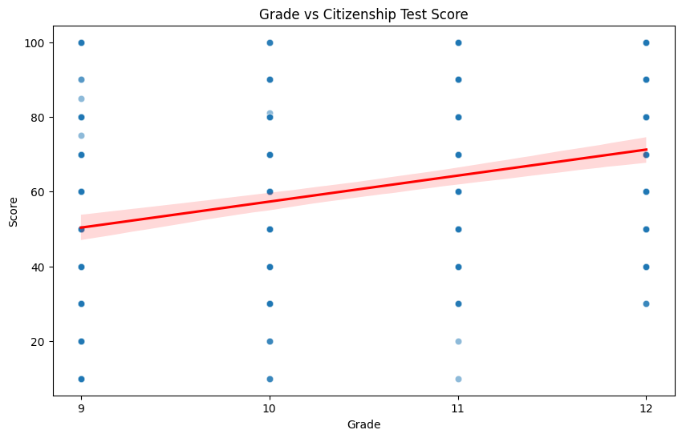
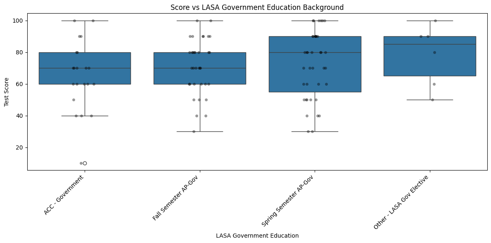
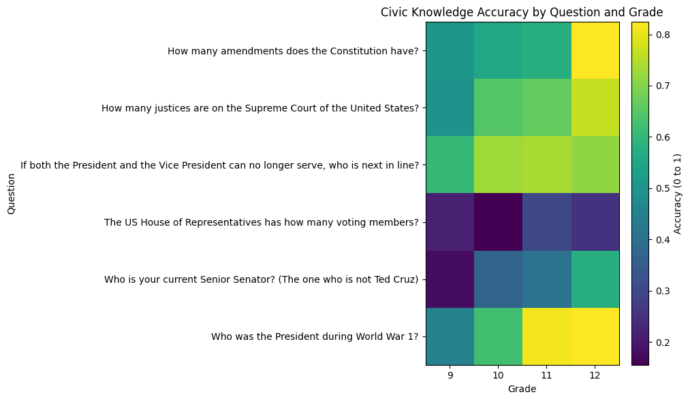
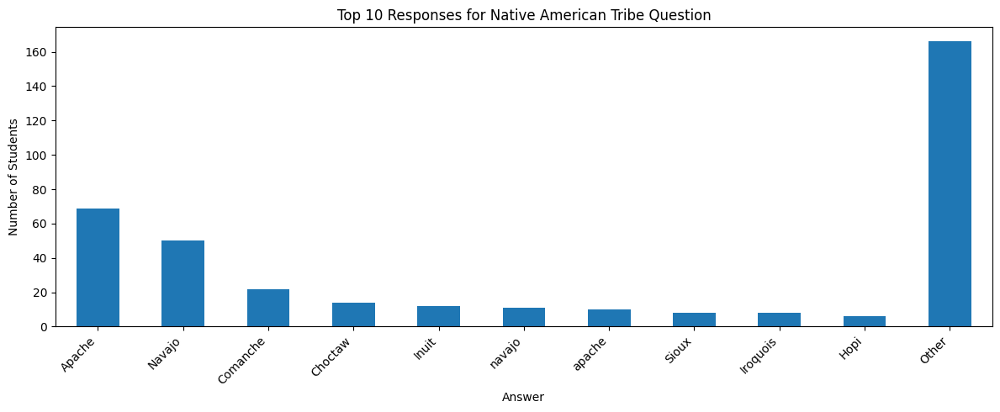
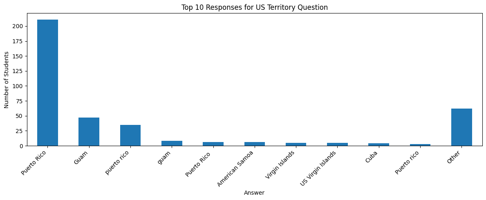

## Introduction

The United States citizenship test evaluates whether someone has a basic understanding of American history, government, and their roles as citizens. Even though people applying for citizenship must prove that they have this knowledge, it leads to another question about how well current high school students know this stuff. For this reason, we conducted our survey among all LASA students and examined their responses to questions taken from the citizenship test.

In particular, we were interested in answering three major questions in our research. 
What general trends do we observe in government knowledge of LASA students and which factors impact this knowledge? 
How can we explain bias or familiarity among students in questions with several correct answers? 
Why should we care? The fact is that civic literacy directly affects our ability to engage in a democratic society.

Through an analysis of trends by grade level, by governmental studies courses, and by types of questions, we hoped to gain insight into both the strengths and weaknesses of the students’ civic knowledge

With that, let's start the analysis!

## How does education impact citizenship test scores?

LASA students range from 14-year-old freshmen to 18-year-old seniors, and therefore have a wide range of general knowledge. It is generally thought that older students should perform better than younger students, but how can we quantify this? Based on our survey data, we found an average increase of roughly 8 points each year. This shows a clear growth that is not necessarily related to government courses taken, as students generally don’t take a government course until senior year.

While there is a large deviation of scores for all grade levels, there’s a clear linear upward trend. A possible reason is the greater awareness and interconnectivity of the government in older students' lives. 

This clearly does not mean that government courses have no impact on the students’ scores. From this graph, we recognize that students in the spring and fall semesters have significantly higher scores than those in the ACC government course. Specifically, the spring semester students, who have the most recent work with a government class, have the highest scores of regular US government students. Additionally, we saw a significant increase in scores for those students who chose to take an additional LASA government elective. This shows that students who are very interested in government outside of the required courses at LASA are more likely to do well on the citizenship test. This is likely due to the fact that these students spend significant amounts of time studying government outside of school, leading to them having an overall greater understanding of the US government.

But does this hold for all of the questions? Not entirely. 

Looking at the above graph, we see that 12th grade essentially dominates in score accuracy for all questions except for the presidential succession. This is not necessarily a real trend, though. Looking at the specific scores, we can see that students in 10th, 11th, and 12th grades all perform very well, and the fact that these students are all proficient and 12th is lower than 10th and 11th can be chalked up to randomness. Additionally, upperclassmen are particularly proficient in knowing the President during WWI. This is clearly because 11th-grade students in AP US History have recently studied WWI and are much more knowledgeable about the topic. 

## How does student bias impact free-response answers?

The US Citizenship test has not only multiple choice questions but also free response questions, such as “Name a Native American Tribe” or “Name an American territory outside of the 50 states and the District of Columbia”. These types of questions give much more insight into the LASA public because they have multiple correct answers. In one scenario, you might expect all students to answer with the same common answer, but there are clear trends in those answers to the questions. 

With the question on Native American tribes, we see that the Apache and Navajo tribes were the most common correct answers. There appears to be a direct correlation between these answers and the sizes of those previous tribes. This is clearly seen as the top five answers are five of the seven largest Native American tribes. In addition, the largest tribe (The Cherokee Nation) was not included in our responses as it was outlawed by the question because we believed that had The Cherokee Nation been an option, it would have dominated all responses. 

The US Territory question was even more one-sided than the Native American Tribes. Puerto Rico clearly dominates all other territories controlled by the United States. This makes sense given that Puerto Rico has a population of over 3 million, and the second largest, Guam, has only 180,000, and the third largest, the U.S. Virgin Islands, has only 80,000 residents. We can clearly see that the population of these territories has led to their order of selection by LASA students, given that the top four US territories by population are all in the same order as LASA student responses.

## How good is the overall government knowledge of LASA students?

LASA students demonstrated generally good government awareness skills; however, the outcomes have proved to be considerably different from what we expected in the beginning. Although there was a relatively high number of students who could give correct answers to most citizenship exam questions, their performance strongly depended on their grade level, recently taken courses, and the nature of the question itself. Perhaps one of the most prominent tendencies in the obtained data was the tendency of improvement with age, as for each successive year, the participants scored an additional 8 points on average. It might mean that awareness grows with age, due both to education and exposure to politics in general.

But, on the other hand, the results revealed that just growing older alone is not a sufficient way of ensuring full comprehension either, since the wide range of scores existed at each grade level; in other words, the lower grades had very high scorers among their ranks, while older students in upper grades could still lack fundamental civic knowledge. Obviously, taking government courses is also essential. As expected, students enrolled in the US Government courses scored better overall, especially the ones taking the class in the spring semester and therefore having the knowledge fresh in mind, than ACC Government students.

The findings were also highly dependent upon the questions themselves. For instance, it can be observed that upperclassmen did well in questions dealing with presidents from the time of the first World War, probably because the AP US History course had covered them quite recently. The same is not true for other topics like presidential succession.

From the analysis of the free-response questions, yet another interesting trend came in the sense that the answers selected by the students were based on how much culturally exposed or known those answers were, rather than being based on answers that are equally correct but just less culturally exposed or known. When it came to Native American tribes, the most common answers selected were those of the Apache and Navajo tribes – the two biggest and best-known Native American tribes. As far as U.S. territories are concerned, Puerto Rico stood out in terms of answers provided.

On the whole, the government knowledge of LASA students seems above average, particularly those in higher grade levels and those more involved in studying history or civics. On the other hand, it can be concluded from the findings that civic knowledge varies greatly and depends largely on education and familiarity with the subject matter.

## Why should we care?

We should care about the overall trend of knowledge in LASA about the current and past government because it reflects on multiple different concepts:

- Knowledge of government can influence civic participation, including voter turnout and engagement in democratic processes. Individuals with a weaker understanding of government and politics may be less likely to participate in elections or may make less informed political decisions 
- Raises an important question: if immigrants seeking U.S. citizenship are required to demonstrate knowledge of American government and history through a citizenship test, why are natural-born citizens not held to a similar standard 
- A strong understanding of government also helps students recognize misinformation and avoid misunderstandings, particularly when encountering political content on social media and other online platforms. 

Overall, we care about students' current and past knowledge of government because it reflects how prepared young people are to participate in democracy. The US citizenship test measures basic understanding of government, history, and responsibilities. By analyzing how students perform, we can show strengths and weaknesses in government education, examine changes in knowledge over time, and better understand how education and media influence political awareness.  
